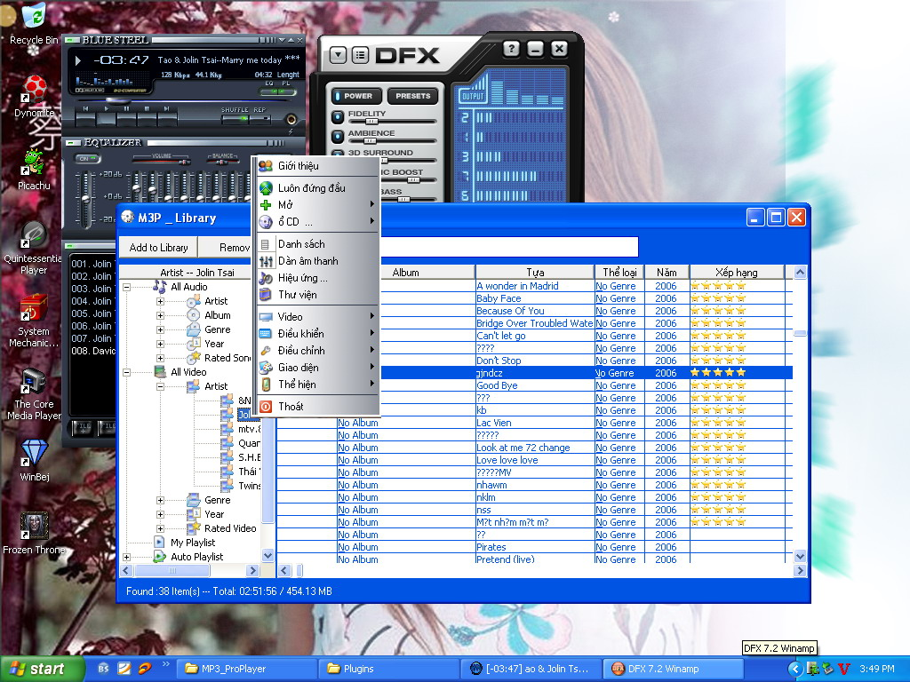



## MP3\_proPlayer 2\.1\.0

### Description

Now support Winamp DSP,Winamp Vis plugins, Language.Allow you write new plugins for this (Vis like M3P_vis* or genaral plugin like M3P_gen*).Rewrite library database for faster (load 507 files in 0.72 sec).

Support graphic menu for skin and rating .

Code inlucde 2 Example Vis plugins, 1 gen plugin.

See screen shot and please vote for me.
 
### More Info
 

             |
---                |---
**Submitted On**   |2006-08-14 15:25:36
**By**             |[Hanachacha](https://github.com/Planet-Source-Code/PSCIndex/blob/master/ByAuthor/hanachacha.md)
**Level**          |Intermediate
**User Rating**    |4.8 (24 globes from 5 users)
**Compatibility**  |VB 6\.0
**Category**       |[Complete Applications](https://github.com/Planet-Source-Code/PSCIndex/blob/master/ByCategory/complete-applications__1-27.md)
**World**          |[Visual Basic](https://github.com/Planet-Source-Code/PSCIndex/blob/master/ByWorld/visual-basic.md)
**Archive File**   |[MP3\_proPla2013508152006\.zip](https://github.com/Planet-Source-Code/hanachacha-mp3-proplayer-2-1-0__1-66279/archive/master.zip)

